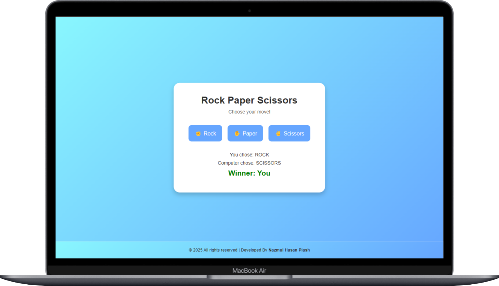

# Rock Paper Scissors Game

 <!-- Add a screenshot if available -->

A responsive and interactive Rock Paper Scissors game built with HTML, CSS, and JavaScript. Play against the computer and track your score!

## 🚀 Features

- 🎮 Classic Rock Paper Scissors gameplay
- 💻 Computer opponent with random choice generation
- 📊 Score tracking for multiple rounds
- 🎨 Modern UI with smooth animations
- 🌈 Gradient background and clean design
- ♿ Accessible with proper ARIA labels and keyboard focus
- 📱 Fully responsive for all device sizes

## 🛠️ Technologies Used

- **Frontend**: HTML5, CSS3, JavaScript (ES6)
- **Styling**: Flexbox, CSS Animations, CSS Variables
- **Tools**: Git, GitHub


## 🧩 How to Play

Click on your choice (Rock ✊, Paper ✋, or Scissors ✌️)

1. The computer will randomly select its move

2. The winner is determined based on classic rules:

3. Rock crushes Scissors

4. Scissors cut Paper

5. Paper covers Rock

6. The score is updated automatically


## 🧑‍💻 Installation / Setup

1. **Clone the repository**
   ```bash
   git clone https://github.com/your-username/rock-paper-scissors.git
   ```
2. **Navigate to the project folder**
   ```bash
   cd rock-paper-scissors
   ```
3. **Open `index.html` in your browser**
   - You can simply double-click on the `index.html` file or use a local server like Live Server in VS Code.

## 📁 Project Structure
```
rock-paper-scissors/
├── index.html          # Main HTML file
├── style.css           # Styling for the game
├── script.js           # Game logic and functionality
└── README.md           # Project documentation
```

---

## 🙌 Contributing

Contributions, issues, and feature requests are welcome!  
Feel free to check the [issues page](https://github.com/devnhpiash/tictactoe-game/rock-paper-scissors) if you'd like to collaborate.

---

## 📄 License

This project is open source and available under the [MIT License](LICENSE).

---

## 📬 Contact

If you like this project or have any questions, feel free to reach out!

- GitHub: [@devnhpiash](https://github.com/devnhpiash)
- Email: developer.nhpiash@gmail.com

---

✨ Have fun playing and customizing the game!